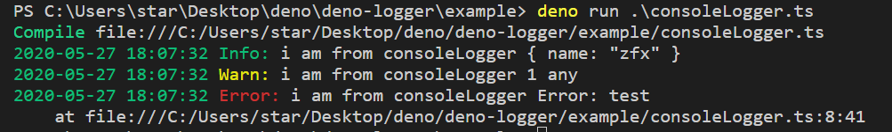
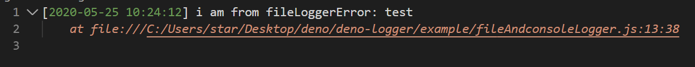
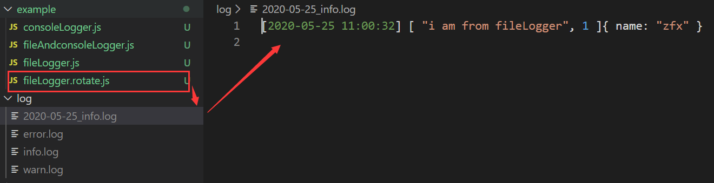

# deno-logger

logger for deno

## Update

### v1.1.0 - 2023.05.04

Remove useless parameter and optimize fileLogger

```diff
interface fileLoggerOptions {
  rotate?: boolean;  // cut by day
- now?: boolean; // print datetime or not
  maxBytes?: number, // the maximum size in bytes that the log file can grow to before rolling over to a new one
  maxBackupCount?: number // maxBackupCount must work with maxBytes
}
```

### v1.0.3 - 2023.05.04

[update code to support modern Deno](https://github.com/deno-library/logger/pull/4).

## Logger interface

```ts
interface fileLoggerOptions {
  rotate?: boolean;  // cut by day
  maxBytes?: number, // the maximum size in bytes that the log file can grow to before rolling over to a new one
  maxBackupCount?: number // maxBackupCount must work with maxBytes
}

interface LoggerInerface {
  constructor()

  info(...args: unknown[]): void
  warn(...args: unknown[]): void
  error(...args: unknown[]): void

  async initFileLogger(dir: string, options: fileLoggerOptions = {}): Promise<void>

  disableConsole(): void
  enableConsole(): void

  disableFile(): void;
  enableFile(): void;

  disable(): void;
  enable(): void;
}
```

## Useage

### console logger

```js
import Logger from "https://deno.land/x/logger@v1.1.0/logger.ts";

const logger = new Logger();

logger.info("i am from consoleLogger", { name: "zfx" });
logger.warn("i am from consoleLogger", 1, "any");
logger.error("i am from consoleLogger", new Error("test"));
```

### file and console logger

```js
import Logger from "https://deno.land/x/logger@v1.1.0/logger.ts";

const logger = new Logger();

// console only
logger.info("i am from consoleLogger", { name: "zfx" });
logger.warn("i am from consoleLogger", 1, "any");
logger.error("i am from consoleLogger", new Error("test"));

await logger.initFileLogger("../log");

// file and console
logger.info("i am from fileLogger", { name: "zfx" });
logger.warn("i am from fileLogger", 1, "any");
logger.error("i am from fileLogger", new Error("test"));
```

### file logger only

```js
import Logger from "https://deno.land/x/logger@v1.1.0/logger.ts";

const logger = new Logger();
await logger.initFileLogger("../log");
logger.disableConsole();

// file only
logger.info(["i am from fileLogger", 1], { name: "zfx" });
```

### file logger optional parameter

interface

```ts
interface fileLoggerOptions {
  rotate?: boolean; // cut by day
  maxBytes?: number;
  // Only available if maxBytes is provided, Otherwise you will get an error
  maxBackupCount?: number;
}
```

example

```js
import Logger from "https://deno.land/x/logger@v1.1.0/logger.ts";
const logger = new Logger();

// cut by day
// filename is [date]_[type].log
// example 2020-05-25_warn.log, 2020-05-25_info.log, 2020-05-25_error.log
await logger.initFileLogger("../log", {
  rotate: true,
});

// maxBytes
// filename is [type].log.[timestamp]
// example: info.log.1590374415956
await logger.initFileLogger("../log", {
  maxBytes: 10 * 1024,
});

// rotate and maxBytes
// filename is [date]_[type].log.[timestamp]
// example: 2020-05-25_info.log.1590374415956
await logger.initFileLogger("../log", {
  rotate: true,
  maxBytes: 10 * 1024,
});

// maxBytes and maxBackupCount
// filename is [type].log.[n]
// example info.log.1, info.log.2 ...
// when reach maxBackupCount, the [type].log.[maxBackupCount-1] will be overwrite
/* 
 detail: 
`maxBytes` specifies the maximum size
in bytes that the log file can grow to before rolling over to a new one. If the
size of the new log message plus the current log file size exceeds `maxBytes`
then a roll over is triggered. When a roll over occurs, before the log message
is written, the log file is renamed and appended with `.1`. If a `.1` version
already existed, it would have been renamed `.2` first and so on. The maximum
number of log files to keep is specified by `maxBackupCount`. After the renames
are complete the log message is written to the original, now blank, file.

Example: Given `log.txt`, `log.txt.1`, `log.txt.2` and `log.txt.3`, a
`maxBackupCount` of 3 and a new log message which would cause `log.txt` to
exceed `maxBytes`, then `log.txt.2` would be renamed to `log.txt.3` (thereby
discarding the original contents of `log.txt.3` since 3 is the maximum number of
backups to keep), `log.txt.1` would be renamed to `log.txt.2`, `log.txt` would
be renamed to `log.txt.1` and finally `log.txt` would be created from scratch
where the new log message would be written.
*/
await logger.initFileLogger("../log", {
  maxBytes: 10 * 1024,
  maxBackupCount: 10,
});

// rotate and maxBytes and maxBackupCount
// filename is [date]_[type].log.[n]
// example 2020-05-25_info.log.1, 2020-05-25_info.log.2
// when reach maxBackupCount, the [type].log.[maxBackupCount-1] will be overwrite
await logger.initFileLogger("../log", {
  rotate: true,
  maxBytes: 10 * 1024,
  maxBackupCount: 10,
});

// rotate and maxBackupCount
// maxBackupCount will be ignored
await logger.initFileLogger("../log", {
  rotate: true,
  maxBackupCount: 10,
});
```

The following conditions will throw an error

```ts
// maxBackupCount
// get error => maxBackupCount must work with maxBytes
await logger.initFileLogger("../log", {
  maxBackupCount: 10,
});
// rotate and maxBackupCount
// get error => maxBackupCount must work with maxBytes
await logger.initFileLogger("../log", {
  rotate: true,
  maxBackupCount: 10,
});
```

## disableConsole and enableConsole

```js
import Logger from "https://deno.land/x/logger@v1.1.0/logger.ts";

const logger = new Logger();

// console
logger.info("console enabled, you can see me");
logger.disableConsole();
// no message is logged
logger.info("console disabled");
logger.enableConsole();
// console
logger.info("console enabled, you can see me");
```

## disableFile and enableFile

```js
import Logger from "https://deno.land/x/logger@v1.1.0/logger.ts";

const logger = new Logger();
await logger.initFileLogger("../log");

logger.disableFile();
// not log to file
logger.info("file disbaled");
logger.enableFile();
// log to file
logger.info("file enabled, you can see me");
```

## disable and enable

- disable
  disable write to file and terminal, don't care if it is currently writing to a file or terminal, but hope to restore the currently configuration later
- enable
  restore previous log configuration: file, terminal or both

example:

1. fileLogger => disable => enable => fileLogger
2. consoleLogger => disable => enable => consoleLogger
3. fileLogger, consoleLogger => disable => enable => fileLogger, consoleLogger

```js
import Logger from "https://deno.land/x/logger@v1.1.0/logger.ts";

const logger = new Logger();
await logger.initFileLogger("../log");

logger.disable();
logger.enable();
```

## test

```bash
deno test --allow-read --allow-write
```

## Screenshots

consoleLogger  


fileLogger  


cut logs by day  


More screenshots in the `screenshots` folder.
